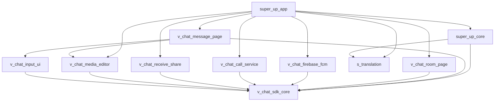

# 🏗️ **ANALYSE COMPLÈTE DE LA CODEBASE SUPER UP**

## 📋 **Vue d'Ensemble**

**Super Up** est une application de messagerie sociale (clone WhatsApp) construite avec une **architecture modulaire** utilisant **Melos** pour la gestion du monorepo. L'application suit une approche **multi-packages** avec séparation claire des responsabilités.

---

## 🎯 **Architecture Globale**

### **Structure du Monorepo**
```
whizpee/
├── melos.yaml                 # Configuration Melos (gestionnaire monorepo)
├── apps/                      # Applications finales
│   ├── super_up_app/         # App principale utilisateur
│   └── super_up_admin/       # Panel d'administration
└── packages/                  # Packages partagés (11 modules)
    ├── super_up_core/        # Core business logic
    ├── s_translation/        # Internationalisation
    └── v_chat_*/            # Modules V-Chat SDK (9 packages)
```

---

## 🔧 **Melos - Le Gestionnaire Central**

### **Configuration Melos (`melos.yaml`)**
```yaml
name: superup
packages:
  - packages/**    # Tous les packages
  - apps/**       # Toutes les applications

command:
  bootstrap:
    runPubGetInParallel: false    # Séquentiel pour éviter conflits
    usePubspecOverrides: true     # Support overrides
```

### **Scripts Melos Principaux**
| Script | Commande | Description |
|--------|----------|-------------|
| `melos bs` | Bootstrap | Installe toutes les dépendances |
| `melos g_app` | Generate App | Build runner pour super_up_app |
| `melos g_admin` | Generate Admin | Build runner pour super_up_admin |
| `melos analyze` | Analyze | Analyse statique du code |
| `melos format` | Format | Formatage du code |
| `melos build_android` | Build APK | Compilation Android |
| `melos build_web` | Build Web | Compilation Web |

---

## 📦 **Analyse des Packages**

### **1. SUPER_UP_CORE** (Package Central)
**Rôle:** Logique métier centrale et utilitaires partagés

**Dépendances Clés:**
- `v_chat_sdk_core` - SDK de chat
- `s_translation` - Internationalisation
- `chopper` - Client HTTP
- `shared_preferences` - Stockage local
- `firebase_*` - Services Firebase

**Exports Principaux:**
```dart
export './src/models/model.dart';        // Modèles de données
export './src/s_constants.dart';         // Constantes app
export './src/utils/utils.dart';         // Utilitaires
export './src/v_chat/v_chat.dart';       // Intégration V-Chat
export './src/widgets/widgets.dart';     // Widgets réutilisables
```

### **2. V_CHAT_SDK_CORE** (Cœur du Chat)
**Rôle:** SDK de messagerie temps réel

**Technologies:**
- **Socket.IO** - Communication temps réel
- **SQLite** - Base de données locale
- **Encryption** - Chiffrement des messages
- **Background Tasks** - Tâches en arrière-plan

**Fonctionnalités:**
- Gestion des connexions WebSocket
- Synchronisation des messages
- Gestion des salles de chat
- Notifications push
- Stockage local sécurisé

### **3. V_CHAT_MESSAGE_PAGE** (Interface Messages)
**Rôle:** Interface utilisateur pour les conversations

**Dépendances:**
- `v_chat_sdk_core` - Logique chat
- `v_chat_input_ui` - Interface de saisie
- `v_chat_media_editor` - Édition média
- `agora_rtc_engine` - Appels vidéo/audio

**Fonctionnalités UI:**
- Liste des messages
- Bulles de chat
- Médias (images, vidéos, audio)
- Réactions aux messages
- Statuts de lecture

### **4. V_CHAT_ROOM_PAGE** (Liste des Conversations)
**Rôle:** Interface pour la liste des chats

**Fonctionnalités:**
- Liste des conversations
- Recherche de chats
- Badges de messages non lus
- Derniers messages
- Gestion des groupes/broadcasts

### **5. V_CHAT_CALL_SERVICE** (Appels Audio/Vidéo)
**Rôle:** Gestion des appels

**Technologies:**
- **Agora SDK** - Moteur d'appels
- **CallKit** (iOS) - Intégration système
- **Foreground Service** (Android) - Service persistant

### **6. V_CHAT_FIREBASE_FCM** (Notifications Push)
**Rôle:** Notifications Firebase

**Fonctionnalités:**
- Réception notifications
- Gestion des tokens
- Navigation depuis notifications

### **7. V_CHAT_MEDIA_EDITOR** (Éditeur Média)
**Rôle:** Édition d'images et vidéos

**Fonctionnalités:**
- Recadrage d'images
- Filtres et effets
- Compression vidéo
- Annotations

### **8. V_CHAT_INPUT_UI** (Interface de Saisie)
**Rôle:** Zone de saisie des messages

**Fonctionnalités:**
- Saisie de texte
- Émojis
- Pièces jointes
- Enregistrement vocal

### **9. V_CHAT_RECEIVE_SHARE** (Partage Entrant)
**Rôle:** Réception de contenus partagés

**Fonctionnalités:**
- Réception de fichiers
- Partage depuis autres apps
- Gestion des intents

### **10. S_TRANSLATION** (Internationalisation)
**Rôle:** Gestion des langues

**Fonctionnalités:**
- Traductions multiples langues
- Génération automatique
- Localisation

---

## 🏛️ **Architecture de l'Application Principale**

### **Structure de super_up_app**
```
lib/
├── main.dart                          # Point d'entrée
├── firebase_options.dart              # Configuration Firebase
├── app/
│   ├── core/                         # Infrastructure
│   │   ├── initialization/           # Initialisation app
│   │   ├── api_service/              # Services API REST
│   │   ├── app_config/               # Configuration app
│   │   ├── theme/                    # Thèmes
│   │   └── utils/                    # Utilitaires
│   └── modules/                      # Modules fonctionnels
│       ├── splash/                   # Écran de démarrage
│       ├── auth/                     # Authentification
│       ├── home/                     # Écran principal
│       ├── chat_settings/            # Paramètres chat
│       └── story/                    # Stories
└── v_chat_v2/                        # Configuration V-Chat
```

---

## 🔄 **Relations et Dépendances**

### **Graphe de Dépendances**


### **Flux de Données**
1. **Initialisation** (`main.dart`)
   - `AppInitializer.initialize()`
   - Configuration Firebase
   - Initialisation V-Chat SDK
   - Services d'arrière-plan

2. **Authentification** (`auth/`)
   - Login téléphone/social
   - Gestion des tokens
   - Profil utilisateur

3. **Chat en Temps Réel** (`v_chat_sdk_core`)
   - Connexion WebSocket
   - Synchronisation messages
   - Notifications

4. **Interface Utilisateur** (`v_chat_*_page`)
   - Rendu des conversations
   - Gestion des interactions
   - Navigation

---

## 🛠️ **Technologies et Outils**

### **Backend & API**
- **REST API:** `api.whizpee.com`
- **WebSocket:** Socket.IO pour temps réel
- **Base de données:** MongoDB (serveur) + SQLite (local)

### **Services Tiers**
- **Firebase:** Auth, FCM, Storage
- **Agora:** Appels audio/vidéo
- **Google Maps:** Géolocalisation
- **OneSignal:** Notifications alternatives

### **Outils de Développement**
- **Melos:** Gestion monorepo
- **build_runner:** Génération de code
- **Chopper:** Client HTTP avec génération
- **flutter_distributor:** Distribution multi-plateforme

---

## 🚀 **Processus de Développement**

### **Workflow Typique**
1. **Bootstrap:** `melos bs`
2. **Génération:** `melos g_app`
3. **Développement:** Modification des packages
4. **Test:** `flutter run` sur device
5. **Build:** `melos build_android`

### **Commandes Essentielles**
```bash
# Installation complète
melos bs

# Génération de code
melos g_app

# Analyse du code
melos analyze

# Formatage
melos format

# Build production
melos build_android
```

---

## 🎯 **Points Clés de l'Architecture**

### **Avantages**
✅ **Modularité:** Séparation claire des responsabilités
✅ **Réutilisabilité:** Packages indépendants
✅ **Maintenabilité:** Code organisé et structuré
✅ **Scalabilité:** Ajout facile de nouvelles fonctionnalités
✅ **Multi-plateforme:** Support Android, iOS, Web, Desktop

### **Défis**
⚠️ **Complexité:** Nombreuses dépendances inter-packages
⚠️ **Configuration:** Setup initial complexe (Firebase, services tiers)
⚠️ **Synchronisation:** Gestion des versions entre packages
⚠️ **Debug:** Débogage across multiple packages

---

## 📊 **Métriques du Projet**

- **11 packages** partagés
- **2 applications** (user + admin)
- **Multi-plateforme** (6 plateformes)
- **Architecture modulaire** avec Melos
- **SDK de chat** complet et réutilisable
- **Services temps réel** avec Socket.IO

Cette architecture permet de créer une application de messagerie robuste, scalable et maintenable, avec une séparation claire entre la logique métier, l'interface utilisateur et les services externes.